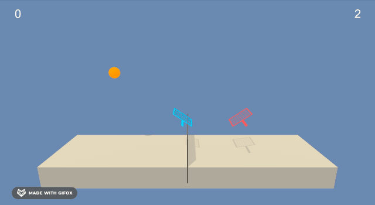

# Tennis

D4PG agent learns to play tennis against itself.

## Overview

In this multi-agent reinforcement learning task, two agents sharing the same neural network weights play tennis, each with the goal of maximizing its own score. Specifically, the environment provides:

- States: A stack of `3` state vectors, each of size `8`, for a total of `24` state variables per time step. The state variables correspond to the agent’s horizontal and vertical position and velocity, as well as the ball’s position.
- Actions: A vector of size `2` corresponding to the agent’s movement away from or towards the net, and jumping.
- Rewards: A reward of `0.1` when the agent hits the ball over the net, and a reward of `-0.01` when the agent hits the ball out of bounds or lets it hit the ground on its side of the court.

Each episode ends when the ball flies out of bounds or hits the ground. The episode score is the maximum of the two scores achieved by the agents. Finally, the environment is considered solved when the average episode score over a window of 100 episodes reaches `0.5`.

## Setup

Follow the instructions [here](https://github.com/udacity/deep-reinforcement-learning/tree/dc65050c8f47b365560a30a112fb84f762005c6b#dependencies) to:

1. Create a `conda` environment.
2. Clone the Udacity Deep RL repository.
3. Install Python packages into the environment.
4. Create an IPython kernel using the environment.

The OpenAI Gym instructions can be skipped.

In order to watch the agent play the game, you also need to download the environment by following the instructions [here](https://github.com/udacity/deep-reinforcement-learning/tree/dc65050c8f47b365560a30a112fb84f762005c6b/p3_collab-compet#getting-started).

## Training the agent

Once you've completed the setup, you can:

1. Open `Tennis.ipynb`.
2. Select the kernel created during setup.
3. Run all the cells in the notebook to train the agent.

## Watching the agent

Follow the instructions [here](https://github.com/udacity/deep-reinforcement-learning/tree/dc65050c8f47b365560a30a112fb84f762005c6b/p3_collab-compet), load the saved neural network weights (`actor.pth` and `critic.pth`), and watch the trained agent interact with the environment!
